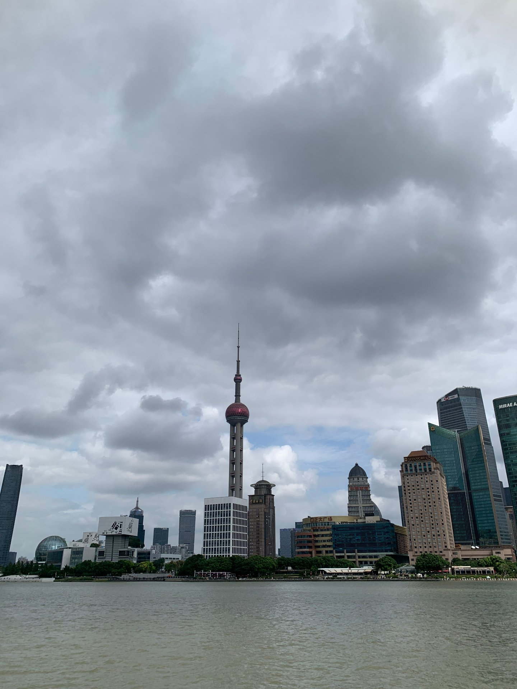
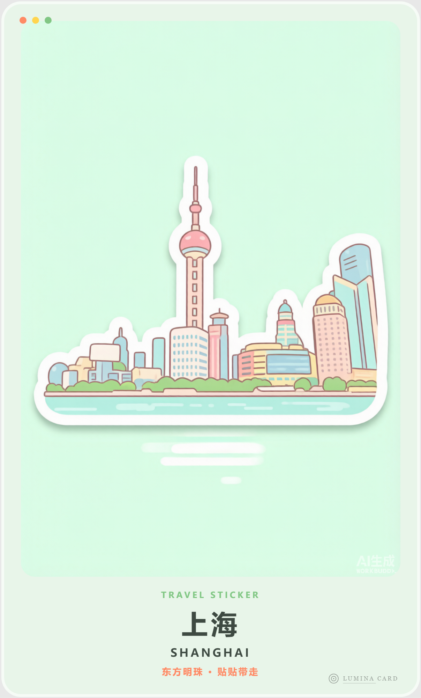

# Lumina Card · 浮光卡片

> Turn any photo into a printable, shareable postcard — via a 7-step pipeline.

English ｜ [简体中文](./README.md)

## ✨ Features

- **7-step pipeline**: analyze → lock subject → composition+retouch (safe aspect-ratio + cleanup) → art transform (oil/watercolor/watercolor-silhouette/ink/sketch/illustration/vintage) → color → post (template) → QC
- **Built-in styles**: `classic` (warm white + gold edge, default), `silhouette` (two-tone flat), `sticker` (die-cut sticker)
- **Extensible**: drop a `<name>.md` (+ optional `<name>.html`) into `templates/` — no core changes needed
- **Bilingual**: triggers on both English and Chinese commands

## 📦 Install

```bash
# User-level (global, recommended)
git clone https://github.com/catex-lab/lumina-card.git ~/.workbuddy/skills/lumina-card

# Project-level (this project only)
git clone https://github.com/catex-lab/lumina-card.git <your-project>/.workbuddy/skills/lumina-card
```

## 🚀 Usage

1. Upload a photo in WorkBuddy.
2. Say: `postcard` / `做成明信片` / `生成贺卡`.
3. The skill runs the full pipeline automatically. To pick a style, say: `use classic template` / `用 silhouette 模板`.

## 🖼️ Showcase

> Sample source: Shanghai · Oriental Pearl Tower skyline (photo copyright reserved by the photographer — see License below)

| Source | `classic` (warm white + gold edge) | `silhouette` (two-tone flat) | `sticker` (die-cut) |
| --- | --- | --- | --- |
|  |  |  |  |


## 🎨 Built-in Styles

| Style | Description | Layout |
| --- | --- | --- |
| `classic` | Warm white background with a fine gold edge — bright and safe for most photos | `templates/classic.html` |
| `silhouette` | Two-tone flat silhouette, bold shapes — great for landmarks and skylines | `templates/silhouette.html` |
| `sticker` | Die-cut sticker illustration on a clean solid background, big rounded corners — ideal for travel souvenirs and merch | `templates/sticker.html` |

## 🧩 Add a New Style

1. Create `templates/<name>.md` — style spec: mood, palette, fonts, layout, ImageGen prompt.
2. Optional: create `templates/<name>.html` — reusable layout with `{{IMAGE}}` etc. placeholders.
3. The pipeline auto-detects it — no need to edit `SKILL.md` or `prompts/`.

## ⚠️ Known Limits

- ImageGen costs ~5–10 credits per generated image.
- ImageGen redraw output is capped at 1024×1536 (1024px short edge), enough for HD screen preview and social sharing. For physical printing (≥1600px short edge), upscale the redrawn base 2× before embedding into the layout.

## 📄 License

**Skill code**: MIT © 2026 catex-lab

**Sample photo copyright**: The sample photo in `showcase/` (`source-shanghai.jpg` and the postcards derived from it) is copyrighted by the photographer **catex-lab** (© 2026 catex-lab). It is provided solely for demonstrating this skill. **Commercial use, redistribution or re-posting without permission is prohibited.** Contact the author before any other use.
